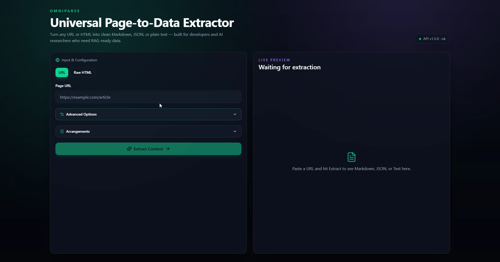

<div align="center">


# OmniParse

**Universal Page-to-Data Extractor**

Convert any URL or HTML into clean **Markdown**, **JSON**, or **Text** for RAG pipelines, datasets, and AI training.

[](LICENSE)
[](CHANGELOG.md)
[](https://www.rust-lang.org/)
[](https://tauri.app/)
[](https://nextjs.org/)

[Features](#features) · [Install](#install) · [Developers](#developers) · [API](#api-endpoints) · [Architecture](docs/architecture/) · [Roadmap](docs/vision.md) · [Trust](#trust--verification) · [Changelog](CHANGELOG.md)

</div>

---

## Preview



<table>
  <tr>
    <td align="center"><strong>Workspace</strong></td>
    <td align="center"><strong>Image resolution</strong></td>
  </tr>
  <tr>
    <td></td>
    <td></td>
  </tr>
</table>

---

## Features

- **High-precision extraction** — Rust readability pipeline with html2md output
- **JavaScript rendering** — headless Chrome/Edge (Windows) or Chrome/Chromium (macOS/Linux) for SPAs
- **Full-size image resolution** — scroll + network capture, lightbox clicks, optional deep gallery crawl
- **Extraction presets** — Fast / Standard / Deep Gallery one-click profiles
- **Live progress & history** — SSE stage updates, local re-run history, markdown rendered preview
- **Per-image & bulk download** — SSRF-safe proxy; parallel bulk save from the Images tab
- **Flexible exports** — Markdown, JSON, Text, PDF, TXT, MD file downloads
- **Native desktop app** — Tauri shell with embedded API (~23 MB on Windows, no Python)
- **Cross-platform** — Windows, macOS (Apple Silicon), and Linux installers from CI
- **Self-hosted** — API on `127.0.0.1:8000`, no vendor lock-in

---

## Install

**Recommended:** download pre-built installers from **[GitHub Releases](https://github.com/Satan2049/omni-parse/releases)**. No Rust, Node, or terminal setup required — run the app and the embedded API starts automatically.

| Platform | Artifacts | Notes |
|----------|-----------|-------|
| **Windows** | Portable `omniparse.exe` · NSIS setup · MSI | WebView2 required (Windows 10/11 usually has it). Chrome or Edge for JS rendering. |
| **macOS** | `.dmg` (Apple Silicon) | Built on `macos-latest` CI. Install Chrome for JS rendering / image resolution. |
| **Linux** | `.deb` · `.AppImage` | x86_64, built on Ubuntu 22.04 CI. Install Chrome or Chromium for JS rendering. |

### Windows paths (local build)

After `.\scripts\build-desktop.ps1`:

| Artifact | Path |
|----------|------|
| Portable exe | `target\release\omniparse.exe` |
| NSIS setup | `target\release\bundle\nsis\OmniParse_*_x64-setup.exe` |
| MSI | `target\release\bundle\msi\OmniParse_*_x64_en-US.msi` |

There is no separate portable zip — the release **`omniparse.exe` is the portable build**.

### macOS / Linux paths (local build)

```bash
./scripts/build-desktop.sh
# Binary:  target/release/omniparse
# Bundles: target/release/bundle/   (.dmg · .deb · .AppImage)
```

CI builds for macOS and Linux run on every **`v*`** tag and via the [**Build Desktop**](.github/workflows/build-desktop.yml) workflow (`workflow_dispatch`).

### Private / LAN URLs

OmniParse blocks URLs that resolve to private networks by default (SSRF protection). To extract intentional LAN pages, enable **Allow Private Network URLs** in the **Arrangements** panel or set `ALLOW_PRIVATE_NETWORK_URLS=true` in:

- **Windows:** `%LOCALAPPDATA%\OmniParse\.env`
- **macOS:** `~/Library/Application Support/omniparse/.env`
- **Linux:** `~/.config/omniparse/.env`

---

## Developers

Use this section only if you are **contributing** or running from source — end users should use [Install](#install) above.

**Prerequisites:** [Rust](https://rustup.rs/) · [Node.js 20+](https://nodejs.org/) · **Chrome, Edge, or Chromium** (for JS rendering)

### Desktop dev (single window)

```bash
cd frontend
npm install
npm run tauri:dev
```

### Web UI + API (two processes)

```bash
# Terminal 1 — API
cargo run --bin omniparse-server

# Terminal 2 — UI
cd frontend && npm install && npm run dev
# http://localhost:3000  (API on :8000)
```

On Windows, **`start.bat`** opens the same two-process dev setup.

Set `NEXT_PUBLIC_API_URL=http://localhost:8000` in `frontend/.env.local` if the API runs elsewhere.

### Release build

| OS | Command |
|----|---------|
| Windows | `.\scripts\build-desktop.ps1` |
| macOS / Linux | `./scripts/build-desktop.sh` |
| Any | `cd frontend && npm run tauri:build` |

---

## Project Structure

```
omni-parse/
├── .github/
│   └── workflows/
│       ├── ci.yml              # Rust + frontend lint/build on PR
│       └── build-desktop.yml   # macOS + Linux release artifacts (tags)
├── .cargo/
│   └── config.toml             # Shared target/ dir for workspace
├── crates/
│   └── omniparse-core/         # Axum API, extraction, browser pool, SSE
├── frontend/
│   ├── src/                    # Next.js UI (workspace, history, presets)
│   └── src-tauri/              # Tauri 2 desktop shell
├── scripts/
│   ├── build-desktop.ps1       # Windows release build
│   ├── build-desktop.sh        # macOS / Linux release build
│   ├── generate-sha256.ps1     # Checksum manifests (Windows)
│   ├── generate-sha256.sh      # Checksum manifests (Unix)
│   └── clean.ps1
├── docs/
│   ├── architecture/           # Module & data-flow docs
│   ├── assets/                 # Logo, screenshots, demo media
│   ├── vision.md               # Product roadmap (v1.6 → v2.0)
│   ├── TRUST.md                # Verification & VirusTotal notes
│   └── index.html              # GitHub Pages landing
├── SHA256.txt                  # Source-tree checksums
├── SHA256-release-v*.txt       # Release binary checksums (after build)
├── Cargo.toml                  # Rust workspace (v1.6.0)
├── CHANGELOG.md
└── start.bat                   # Windows dev launcher (contributors)
```

See [`docs/architecture/codebase-map.md`](docs/architecture/codebase-map.md) for module-level detail.

---

## API Endpoints

| Method | Path | Description |
|--------|------|-------------|
| `POST` | `/extract` | Extract title, markdown, metadata, and images |
| `POST` | `/extract/stream` | Same as `/extract` with SSE progress events |
| `POST` | `/convert` | Convert text/markdown to PDF, TXT, or MD download |
| `GET` | `/images/download` | Download a public image URL (SSRF-safe proxy) |
| `GET` | `/settings` | Read server arrangement values |
| `PUT` | `/settings` | Update arrangements (persisted to `.env`) |
| `GET` | `/health` | Health check |

### Extract options (selected)

| Field | Default | Description |
|-------|---------|-------------|
| `render_js` | `false` | Render with headless browser before extraction |
| `extract_images` | `true` | Include image URLs in the response |
| `resolve_fullsize_images` | `false` | Fast browser pass: scroll + network/lazy URLs |
| `resolve_deep` | `false` | Slow crawl: gallery items + lightboxes |

### Example

```bash
curl -X POST http://localhost:8000/extract \
  -H "Content-Type: application/json" \
  -d '{"url": "https://example.com/article", "render_js": true}'
```

---

## Trust & Verification

| Resource | Purpose |
|----------|---------|
| [SHA256.txt](SHA256.txt) | Checksums for scripts, workflows, and workspace manifests |
| `SHA256-release-v1.6.0.txt` | Checksums for release binaries (after `tauri:build` or CI) |
| [docs/TRUST.md](docs/TRUST.md) | Verification steps, false-positive notes, VirusTotal reports |

Regenerate checksums:

```powershell
powershell -File scripts\generate-sha256.ps1
powershell -File scripts\generate-sha256.ps1 -Release   # after desktop build
```

```bash
./scripts/generate-sha256.sh
./scripts/generate-sha256.sh --release
```

### VirusTotal

Community scans for release builds. Detection counts change as vendors update signatures — open each report for the current vendor list.

#### v1.6.0

| Platform | Artifact | Detections | Report |
|----------|----------|------------|--------|
| Windows | Portable `omniparse.exe` | Pending scan | _Upload from [Releases](https://github.com/Satan2049/omni-parse/releases)_ |
| Windows | NSIS setup | Pending scan | _Upload from [Releases](https://github.com/Satan2049/omni-parse/releases)_ |
| Windows | MSI installer | Pending scan | _Upload from [Releases](https://github.com/Satan2049/omni-parse/releases)_ |
| macOS | `.dmg` (Apple Silicon) | Pending scan | _Upload from [Releases](https://github.com/Satan2049/omni-parse/releases)_ |
| Linux | `.deb` | Pending scan | _Upload from [Releases](https://github.com/Satan2049/omni-parse/releases)_ |
| Linux | `.AppImage` | Pending scan | _Upload from [Releases](https://github.com/Satan2049/omni-parse/releases)_ |

> After publishing v1.6.0 release assets, upload each installer to [VirusTotal](https://www.virustotal.com) and replace the rows above with report links (see [docs/TRUST.md](docs/TRUST.md)).

#### v1.5.0 (previous Windows release)

| Artifact | Detections | Report |
|----------|------------|--------|
| Portable `omniparse.exe` | 1 / 71 | [VirusTotal](https://www.virustotal.com/gui/file/7747f9dfae83b697a8c1a4eab1782fd3f91ee5c7879fd27d89191ae419c9af7c/detection) |
| MSI installer | see report | [VirusTotal](https://www.virustotal.com/gui/file/4734d63bc79e82e85c618a2ee2a876b5284f60cfc0a559c98d473b88000b676a) |
| NSIS setup | 3 / 71 | [VirusTotal](https://www.virustotal.com/gui/file/02d8ced2f0caa4047e88a2a7c132e8abcfeb687789880d1ed120a5df51953359) |

A few heuristic flags on **unsigned** desktop tools are common (ML scores, installer packers). Verify SHA-256, build from source, or use the portable binary if you prefer. Details: [docs/TRUST.md](docs/TRUST.md).

---

## Tech Stack

| Layer | Technologies |
|-------|----------------|
| API | Rust, Axum, reqwest, chromiumoxide, readability, printpdf |
| Desktop | Tauri 2 |
| Frontend | Next.js 15, TypeScript, Tailwind CSS, shadcn/ui |
| CI | GitHub Actions — `ci.yml` + `build-desktop.yml` (macOS, Linux) |

---

## Contributing

Contributions are welcome. See [CONTRIBUTING.md](CONTRIBUTING.md) and the [product roadmap](docs/vision.md).

---

## License

[MIT](LICENSE) © OmniParse Contributors
