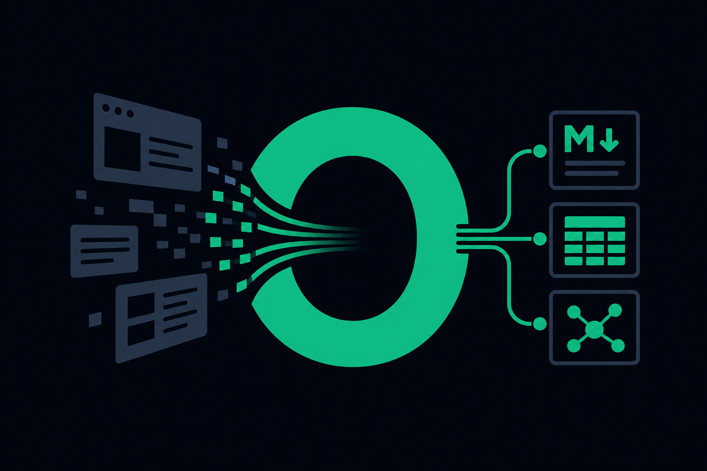
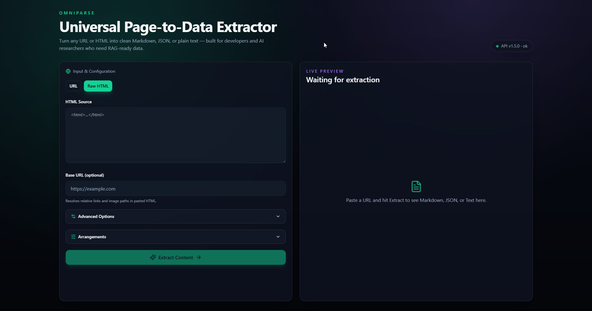
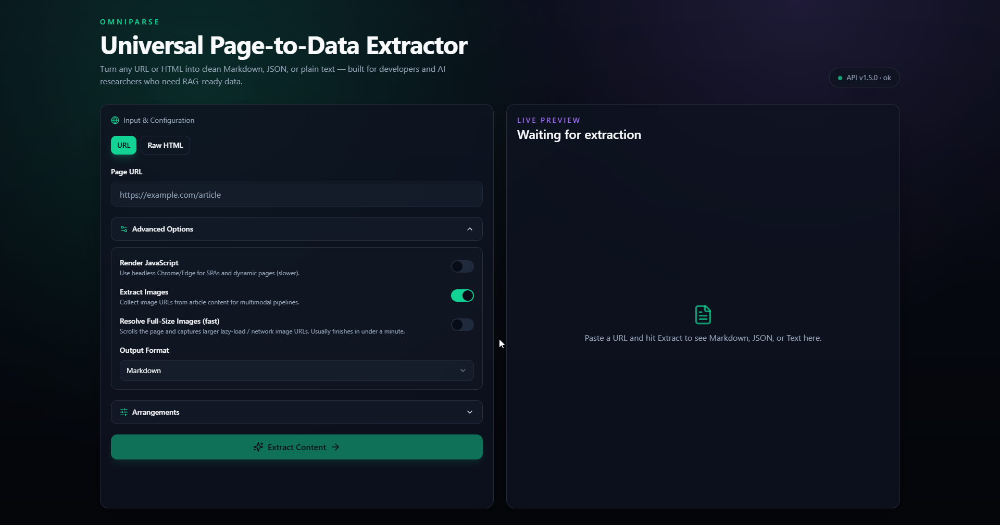

<div align="center">



# OmniParse

**Universal Page-to-Data Extractor**

Convert any URL or HTML into clean **Markdown**, **JSON**, or **Text** for RAG pipelines, datasets, and AI training.

[](LICENSE)
[](CHANGELOG.md)
[](https://www.rust-lang.org/)
[](https://tauri.app/)
[](https://nextjs.org/)

[Features](#features) · [Quick Start](#quick-start) · [API](#api-endpoints) · [Architecture](docs/architecture/) · [Trust](#trust--verification) · [Changelog](CHANGELOG.md)

</div>

---

## Preview

<table>
  <tr>
    <td align="center"><strong>Workspace</strong></td>
    <td align="center"><strong>Image resolution</strong></td>
  </tr>
  <tr>
    <td></td>
    <td></td>
  </tr>
</table>

> Replace mock screenshots with real captures before a public release — see [docs/assets/README.md](docs/assets/README.md). Add a `docs/assets/demo.gif` screen recording for a hero demo.

---

## Features

- **High-precision extraction** — Rust readability pipeline with html2md output
- **JavaScript rendering** — headless Chrome/Edge for SPAs and dynamic pages
- **Full-size image resolution** — scroll + network capture, lightbox clicks, optional deep gallery crawl
- **Per-image & bulk download** — SSRF-safe proxy from the Images tab
- **Flexible exports** — Markdown, JSON, Text, PDF, TXT, MD file downloads
- **Arrangements panel** — tune timeouts and limits from the UI (saved to `.env`)
- **Compact desktop app** — single `omniparse.exe` with embedded API (~23 MB, no Python)
- **Self-hosted** — API on `127.0.0.1:8000`, no vendor lock-in

---

## Quick Start

### Windows (recommended)

**Prerequisites:** [Rust](https://rustup.rs/) · [Node.js 20+](https://nodejs.org/) · **Chrome or Edge** (for JS rendering / image resolution)

Double-click **`start.bat`** in the project root.

On first run:

1. `npm install` in `frontend/`
2. Two terminals open — API on **8000**, UI on **3000**

| Service | URL |
|---------|-----|
| UI | http://localhost:3000 |
| API | http://localhost:8000 |

### Desktop app (installer or portable)

```powershell
.\scripts\build-desktop.ps1
```

| Artifact | Path | Use |
|----------|------|-----|
| **Portable exe** | `target\release\omniparse.exe` | Copy anywhere and run — no install step |
| **NSIS setup** | `target\release\bundle\nsis\OmniParse_1.5.0_x64-setup.exe` | Per-machine installer (`C:\Program Files\OmniParse`) |
| **MSI** | `target\release\bundle\msi\OmniParse_1.5.0_x64_en-US.msi` | Enterprise / Group Policy installs |

There is no separate “portable zip” target — the release **`omniparse.exe` is the portable build**. WebView2 must be present (Windows 10/11 usually has it).

### Run in terminal (no installer, no packaged exe)

**Browser UI + API (development):**

```bash
# Terminal 1 — API
cargo run --bin omniparse-server

# Terminal 2 — UI
cd frontend && npm run dev
# open http://localhost:3000
```

Or double-click **`start.bat`** — it does the same thing in two windows.

**Desktop window (development):**

```bash
cd frontend && npm run tauri:dev
```

### Manual setup

**API (from repo root):**

```bash
cargo run --bin omniparse-server
```

**Frontend:**

```bash
cd frontend
npm install
cp .env.example .env.local    # Windows: copy .env.example .env.local
npm run dev
```

**Desktop dev:**

```bash
cd frontend
npm run tauri:dev
npm run tauri:build    # release installer
```

Set `NEXT_PUBLIC_API_URL=http://localhost:8000` in `frontend/.env.local` if the API runs elsewhere.

### Private / LAN URLs

OmniParse blocks URLs that resolve to private networks by default (SSRF protection). To extract intentional LAN pages, enable **Allow Private Network URLs** in the **Arrangements** panel or set `ALLOW_PRIVATE_NETWORK_URLS=true` in `%LOCALAPPDATA%\OmniParse\.env`.

---

## Project Structure

```
omni-parse/
├── Cargo.toml                  # Rust workspace
├── crates/
│   └── omniparse-core/         # API library + omniparse-server binary
├── frontend/
│   ├── src/                    # Next.js UI
│   └── src-tauri/              # Tauri desktop shell (thin)
├── scripts/                    # Launchers, build, SHA256 generation
├── docs/
│   ├── assets/                 # Logo, screenshots, demo media
│   ├── architecture/           # Architecture docs
│   └── index.html              # GitHub Pages landing
├── SHA256.txt                  # Source checksums
├── SHA256-release-v1.5.0.txt   # Release binary checksums
└── start.bat
```

See [`docs/architecture/codebase-map.md`](docs/architecture/codebase-map.md) for module-level detail.

---

## API Endpoints

| Method | Path | Description |
|--------|------|-------------|
| `POST` | `/extract` | Extract title, markdown, metadata, and images |
| `POST` | `/convert` | Convert text/markdown to PDF, TXT, or MD download |
| `GET` | `/images/download` | Download a public image URL (SSRF-safe proxy) |
| `GET` | `/settings` | Read server arrangement values |
| `PUT` | `/settings` | Update arrangements (persisted to `.env`) |
| `GET` | `/health` | Health check |

### Extract options (selected)

| Field | Default | Description |
|-------|---------|-------------|
| `render_js` | `false` | Render with headless Chrome/Edge before extraction |
| `extract_images` | `true` | Include image URLs in the response |
| `resolve_fullsize_images` | `false` | Fast browser pass: scroll + network/lazy URLs |
| `resolve_deep` | `false` | Slow crawl: gallery items + lightboxes |

### Example

```bash
curl -X POST http://localhost:8000/extract \
  -H "Content-Type: application/json" \
  -d '{"url": "https://example.com/article", "render_js": true}'
```

---

## Trust & Verification

| Resource | Purpose |
|----------|---------|
| [SHA256.txt](SHA256.txt) | Checksums for launchers, workspace manifest, scripts |
| `SHA256-release-v1.5.0.txt` | Checksums for `omniparse.exe` and installers (generated after `tauri:build`) |
| [docs/TRUST.md](docs/TRUST.md) | Verification steps, false-positive notes, VirusTotal reports |

Regenerate checksums:

```powershell
powershell -File scripts\generate-sha256.ps1
powershell -File scripts\generate-sha256.ps1 -Release   # after tauri:build
```

### VirusTotal (v1.5.0)

| Artifact | Detections | Report |
|----------|------------|--------|
| Portable `omniparse.exe` | 1 / 71 | [VirusTotal](https://www.virustotal.com/gui/file/7747f9dfae83b697a8c1a4eab1782fd3f91ee5c7879fd27d89191ae419c9af7c/detection) |
| MSI installer | see report | [VirusTotal](https://www.virustotal.com/gui/file/4734d63bc79e82e85c618a2ee2a876b5284f60cfc0a559c98d473b88000b676a) |
| NSIS setup | 3 / 71 | [VirusTotal](https://www.virustotal.com/gui/file/02d8ced2f0caa4047e88a2a7c132e8abcfeb687789880d1ed120a5df51953359) |

A few heuristic flags on **unsigned** desktop tools are common (ML scores, installer packers). Verify SHA-256, build from source, or use the portable exe if you prefer. Details: [docs/TRUST.md](docs/TRUST.md).

---

## Tech Stack

| Layer | Technologies |
|-------|----------------|
| API | Rust, Axum, reqwest, chromiumoxide, readability, printpdf |
| Desktop | Tauri 2 |
| Frontend | Next.js 15, TypeScript, Tailwind CSS, shadcn/ui |

---

## Contributing

Contributions are welcome. See [CONTRIBUTING.md](CONTRIBUTING.md).

---

## License

[MIT](LICENSE) © OmniParse Contributors

---

## Maintainer checklist — your action items

These steps require **you** (they cannot be fully automated from the repo alone):

### 1. Record a demo GIF
- Follow [docs/assets/README.md](docs/assets/README.md)
- Save as `docs/assets/demo.gif` and add it under **Preview** in this README

### 2. Replace mock screenshots
- Capture real UI at 16:9 and overwrite `docs/assets/screenshot-workspace.png` and `screenshot-images.png`

### 3. Publish a GitHub Release
```powershell
.\scripts\build-desktop.ps1
powershell -File scripts\generate-sha256.ps1 -Release
```
- Attach `OmniParse_1.5.0_x64-setup.exe`, `SHA256-release-v1.5.0.txt`, and optionally the MSI

### 4. ~~VirusTotal scan~~ ✓
- Portable, MSI, and NSIS reports are linked in [docs/TRUST.md](docs/TRUST.md) and above
- Re-upload and update links after each new release build

### 5. Enable GitHub Pages
- Repository **Settings → Pages →** source: `/docs` folder
- Landing page: `docs/index.html`

### 6. (Optional) Code signing
- Sign `omniparse.exe` / the installer with an Authenticode certificate to reduce SmartScreen warnings

Tell me when steps 1–4 are done and we can wire the VirusTotal link, demo GIF, and release workflow into CI.
